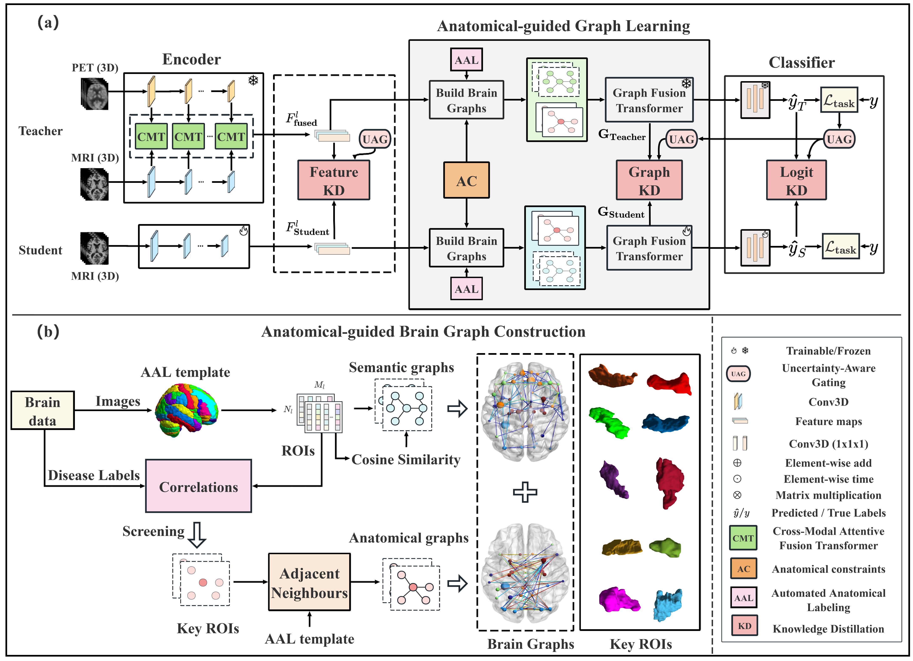

# AGMD: Anatomical Graph-based Multilevel Distillation for Robust Alzheimer's Disease Diagnosis with Missing Modalities (MICCAI 2025)

- This is an official code repository for our paper, which can be found in [here](https://papers.miccai.org/miccai-2025/paper/3438_paper.pdf "here")👈.
- Hope you like this work and do better works 😁.
- The complete code will be publicly available soon! ⌛


## Overall framework



## Highlights
1. Encodes AD pathology at three levels:
     - local (3D CNN for ROI atrophy),
     - regional (graph convolution for inter-ROIs connectivity),
     - global (transformer for the semantic context of the brain)
2. Anatomically guided graphs using structural connectivity derived from AD-aware brain regions with their adjacent neighbors
3. Uncertainty-aware gating mechanism to dynamically adjust instance-level distillation based on the model's prediction entropy


## Project structure:

```
AGMD:
	model.py
	run.py
	utils.py
```
[TODO]

## How to run the code

- ### Prepare environment. [TODO]
1. Create a conda environment <br>
conda create -n AGMD
2. install Pytorch cuda <br>
conda install pytorch torchvision torchaudio pytorch-cuda=11.8 -c pytorch -c nvidia
3. install required lib<br>
pip install -r requirements.txt

- ### How to train:
[TODO]

- ### How to test:
[TODO]


## Citation

If you think this repository is useful, please cite this paper 😘:
```BibTeX
@inproceedings{liu2025agmd,
  title={Anatomical graph-based multilevel distillation for robust Alzheimer’s Disease diagnosis with missing modalities},
  author={Liu, Fei and Wang, Huabin and Jaward, Mohamed Hisham and Liang, Shiuan-Ni and Ong, Huey Fang and Cheng, Jiayuan},
  booktitle={International Conference on Medical Image Computing and Computer-Assisted Intervention},
  pages={74--83},
  year={2025},
  organization={Springer},
  doi={doi.org/10.1007/978-3-032-04984-1_8}
}
	}
```

## Issue

If you have any questions or problems when using the code in this project, please feel free to send an email to [liu.jason0728@gmail.com](mailto:liu.jason0728@gmail.com "liu.jason0728@gmail.com"). You can also post an issue here.
